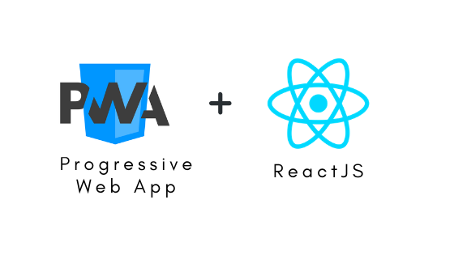

# innovationlab2_boiler_plate

As Martin Fowley (https://fr.wikipedia.org/wiki/Martin_Fowler) wrote, architecture is "the shared understanding that the expert developers have of the system design."

Here are some templates to begin with the Innovation lab #2 project web development part.
We will use these boiler plates to begin with our social network mobile development.

You will find two directories. Each one implements a way to consider mobile application development (progressive web apps with plain Javascript or with ReactJs). 

JS 
## A classic PWA example using Vanilla JavaScript.

REACT 
## A PWA boiler plate using React libraries.
